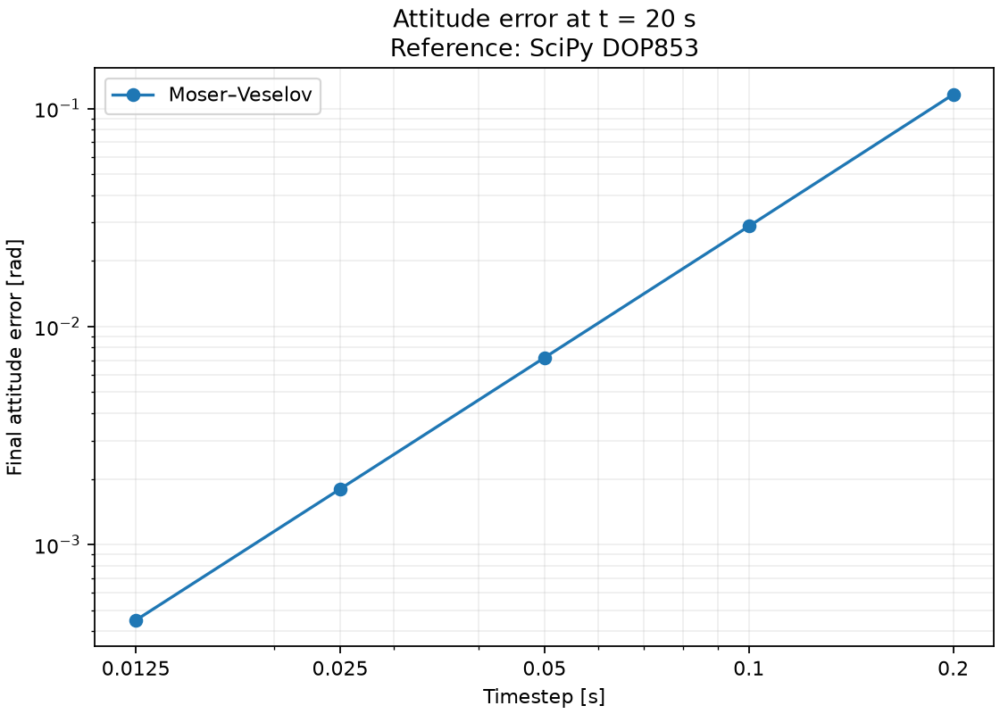
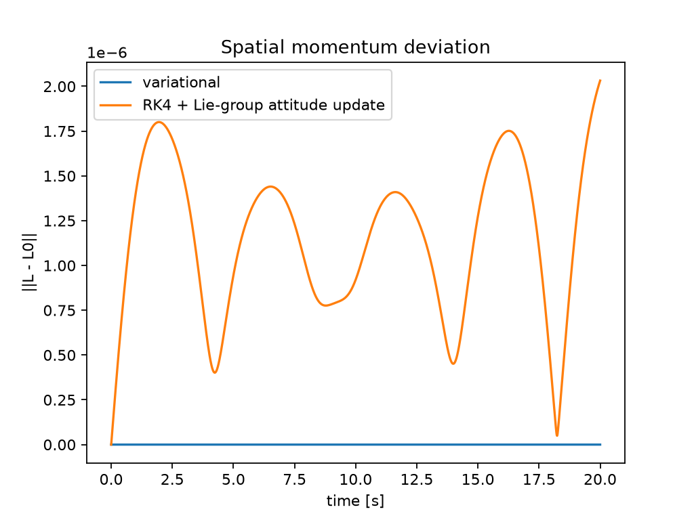

# SympLie

[](https://github.com/seldak/symplie/actions/workflows/ci.yml)

SympLie is a small experimental JAX package for SO(3)/SE(3) operations and one
structure-preserving rigid-body integrator.

It is not a replacement for jaxlie, Sophus, Drake, or Pinocchio. Use those for
a broad, mature geometry or robotics stack; use SympLie to study and differentiate
through its Moser–Veselov free-rigid-body step.

It currently provides:

- A Moser–Veselov-style variational integrator for a torque-free rigid body.
- Numerically stable SO(3) and SE(3) exponential and logarithm maps.
- JIT-compatible hat/vee operators and SO(3) left Jacobians.
- Regression tests for rotation validity, invariant preservation, and Lie-group
  round trips, including small-angle and near-$\pi$ cases.

## Free rigid-body integrator

State is $(R, \pi)$:
- $R \in SO(3)$ orientation
- $\pi \in R^3$ body angular momentum ($\pi = J\omega$)

One step computes a relative rotation $F \in SO(3)$ then updates:
- $R_{k+1} = R_k F$
- $\pi_{k+1} = F^T \pi_k$

This implies spatial momentum is conserved:
$R_{k+1} \pi_{k+1} = R_k \pi_k$.

### SO(3) exponential and logarithm maps

SympLie provides complementary maps between rotation vectors and matrices:

```python
import jax.numpy as jnp
from symplie import expSO3, logSO3

w = jnp.array([0.1, -0.2, 0.3])
R = expSO3(w)
w_recovered = logSO3(R)
```

`logSO3(R)` returns the principal rotation vector $w \in \mathbb{R}^3$ whose
direction is the rotation axis and whose magnitude is the angle in radians,
with principal angle in $[0, \pi]$. The implementation uses separate numerical
paths near the identity and near $\pi$, where the standard closed-form formula
is ill-conditioned. Both maps are compatible with JAX JIT compilation.

For rotation vectors on the principal branch, the test suite checks
`logSO3(expSO3(w)) \approx w`. It also checks
`expSO3(logSO3(R)) \approx R`, including rotations close to $\pi$.

### SE(3) exponential and logarithm maps

SE(3) twists use the convention $\xi=[\rho,\phi]$, with translation first and
the SO(3) rotation vector second. Run the JIT-compiled round-trip example with:

```bash
python examples/se3_exp_log.py
```

The example maps a mixed translational and rotational twist into a homogeneous
transformation, recovers the principal twist, and reports the maximum numerical
error.

## Install

Create an environment and install the package from the repository:

```bash
python -m venv .venv
source .venv/bin/activate
python -m pip install -e .
```

JAX accelerator installations depend on the platform and CUDA version. Follow
the [official JAX installation guide](https://docs.jax.dev/en/latest/installation.html)
for GPU or TPU support.

For development:

```bash
pip install -e ".[dev]"
```

## Quickstart

```python
import jax.numpy as jnp
from symplie import energy, simulate_free_rigid_body, spatial_momentum

J = jnp.diag(jnp.array([0.6, 1.0, 1.8]))
R0 = jnp.eye(3)
pi0 = jnp.array([0.2, 0.7, 1.0])

Rs, pis, solver_info = simulate_free_rigid_body(
    R0,
    pi0,
    J,
    dt=1e-2,
    steps=2000,
    newton_iters=8,
)

assert solver_info.converged.all(), solver_info.residual_norm.max()

L0 = spatial_momentum(Rs[0], pis[0])
E0 = energy(pis[0], J)
```

## Run tests

```bash
pytest
```

## Generate plots

```bash
python scripts/attitude_accuracy.py --out artifacts
python scripts/make_plots.py --out artifacts
```

This creates:

```
artifacts/attitude_error_vs_dt.png
artifacts/attitude_error_vs_dt.csv
artifacts/attitude_accuracy.json
artifacts/spatial_momentum_error.png
artifacts/energy_drift.png
```



Final attitude error after 20 seconds, measured against a SciPy DOP853
reference. Halving the timestep reduces the error by approximately a factor
of four, consistent with second-order convergence.



Spatial angular momentum over 20 seconds at $dt=0.01$ s. The baseline uses
RK4 for body momentum and exponential attitude updates.

[Relative energy deviation](artifacts/energy_drift.png) is available separately.

The nonlinear solve uses deterministic backtracking and exposes its result:

```python
from symplie import solve_F_with_info

F, info = solve_F_with_info(pi0, J, 1e-2)
assert info.converged, info.residual_norm
```

SympLie currently models only torque-free rotational dynamics. It does not
implement external wrenches, constraints, contact, IMU models, or SE(3)
dynamics.
