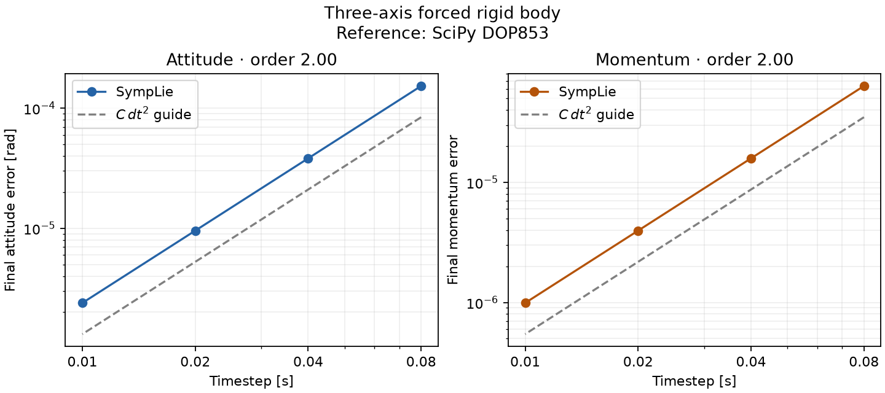

# SympLie

[](https://github.com/seldak/symplie/actions/workflows/ci.yml)

SympLie is an experimental JAX package for differentiable Lie-group
rigid-body dynamics. It combines batched $SO(3)$ and $SE(3)$ operations
with structure-preserving rotational integration and geometric attitude
control.

It currently provides:

- Numerically stable, batched $SO(3)$ and $SE(3)$ exponential and
  logarithm maps.
- Torque-free and externally forced Moser–Veselov rigid-body integration.
- A composable forced step for custom JAX scans and control loops.
- State-dependent body torque under zero-order hold.
- Fixed-target geometric PD attitude control.
- Gyroscope attitude propagation with optional bias compensation.
- JIT compilation, automatic differentiation, and per-step solver diagnostics.

SympLie is not a replacement for jaxlie, Sophus, Drake, or Pinocchio. It has a
deliberately narrow focus on Lie-group rotational dynamics and control.

## Attitude control


A geometric PD controller regulates a $0.781$ rad initial attitude error
while damping angular velocity. The command is recomputed every $0.01$ s and
held constant between samples. After eight seconds, attitude error is
$1.15\times10^{-3}$ rad and angular-rate norm is
$1.87\times10^{-3}$ rad/s.

## Forced dynamics accuracy



A smooth three-axis body torque is integrated against a quaternion-based SciPy
DOP853 reference. Halving the timestep reduces both final attitude and momentum
error by a factor of four; their measured convergence orders are 2.00.

The torque-free spatial-momentum and energy comparisons remain available in
the [numerical validation notes](docs/validation.md).

## Quickstart

```python
import jax.numpy as jnp
from symplie import rigid_body_step

J = jnp.diag(jnp.array([0.6, 1.0, 1.8]))
R = jnp.eye(3)
pi = jnp.array([0.2, 0.7, 1.0])
torque = jnp.array([0.01, -0.02, 0.03])

R_next, pi_next, info = rigid_body_step(
    R,
    pi,
    J,
    torque,
    torque,
    dt=0.01,
)
assert info.converged, info.residual_norm
```

For closed-loop control, run:

```bash
python examples/attitude_control.py
```

## Installation

```bash
python -m venv .venv
source .venv/bin/activate
python -m pip install -e .
```

For tests and figure generation:

```bash
python -m pip install -e ".[dev]"
pytest
```

JAX accelerator installations depend on the platform and CUDA version. Follow
the [official JAX installation guide](https://docs.jax.dev/en/latest/installation.html)
for GPU or TPU support. The test suite uses the active JAX backend.

### NVIDIA GPU

After installing SympLie, install the CUDA-enabled JAX package:

```bash
python -m pip install --upgrade "jax[cuda13]"
python -c 'import jax; print(jax.devices()); assert jax.default_backend() == "gpu"'
```

Use `jax[cuda12]` when required by the installed driver or GPU. Consult the
JAX installation guide for current compatibility requirements.

## Documentation

The [documentation](https://seldak.github.io/symplie/) covers installation,
frame and torque-sampling conventions, numerical validation, and the complete
public API.

Regenerate the published figures with:

```bash
python scripts/attitude_accuracy.py --out artifacts --docs-out docs/assets
python scripts/control_response.py --out artifacts --docs-out docs/assets
python scripts/make_plots.py --out artifacts
```

## Scope

SympLie currently models rotational motion only. It does not implement
translation, full $SE(3)$ rigid-body dynamics, contact, constraints,
actuator allocation, state estimation, or robotics middleware.
