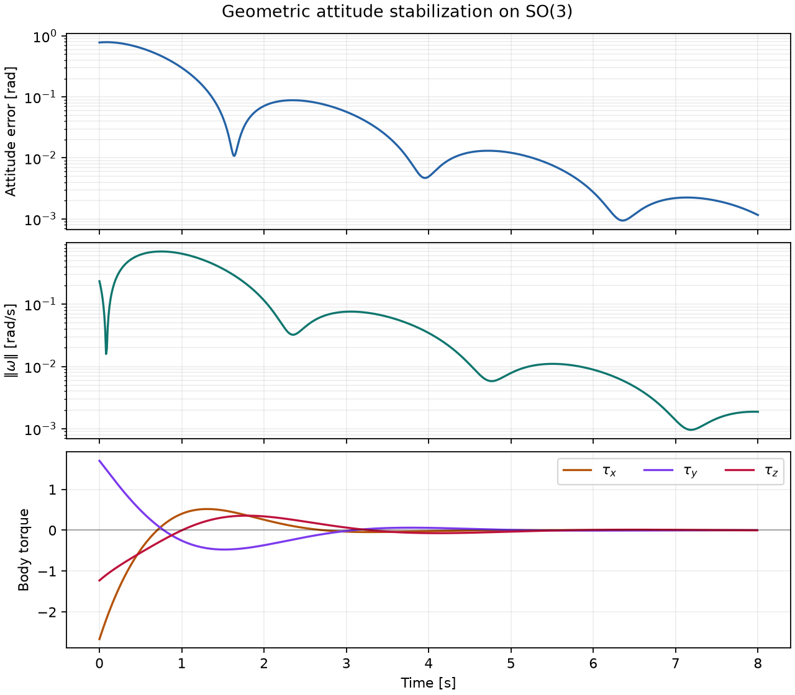

# Numerical validation

## Forced convergence

The forced benchmark applies a smooth three-axis body torque and compares the
final state with a high-accuracy SciPy DOP853 solution integrated in quaternion
and body-momentum coordinates.


Halving the timestep reduces both attitude and momentum error by approximately
four. The observed orders are 2.00 for both quantities.

## Closed-loop attitude control

The geometric PD example regulates a large initial attitude error while
damping angular velocity. Controller output is held constant between samples.



The plotted run reduces geodesic attitude error from \(0.781\) rad to
\(1.15\times10^{-3}\) rad over eight seconds. Every nonlinear solve satisfies
the configured residual tolerance.

## Torque-free invariants

The torque-free update preserves spatial angular momentum algebraically.
The repository retains the
[spatial-momentum comparison](https://github.com/seldak/symplie/blob/main/artifacts/spatial_momentum_error.png)
and [energy comparison](https://github.com/seldak/symplie/blob/main/artifacts/energy_drift.png)
as supporting artifacts rather than headline figures.

All figure-generation scripts abort if a nonlinear solve fails its configured
tolerance.

## Reproducing the figures

```bash
python scripts/attitude_accuracy.py --out artifacts --docs-out docs/assets
python scripts/control_response.py --out artifacts --docs-out docs/assets
python scripts/make_plots.py --out artifacts
```
